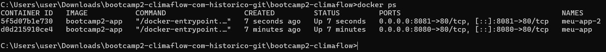

# ClimaFlow

## Autor
Ágatha Castro — Matrícula: 22601851

## Descrição
O ClimaFlow é uma aplicação web para consultar o clima atual de uma cidade. Na Etapa 02, o projeto passou a permitir salvar e excluir cidades favoritas usando persistência de dados no Supabase e também passou a ser executado em containers Docker.

## API utilizada
- **Open-Meteo**
- Documentação: https://open-meteo.com/en/docs
- Geocoding: `https://geocoding-api.open-meteo.com/v1/search`
- Previsão atual: `https://api.open-meteo.com/v1/forecast`

## Persistência de dados
Foi utilizado o **Supabase**, com banco de dados PostgreSQL.

Tabela: `favoritos`

Campos:
- `id`: identificador do registro
- `created_at`: data e hora em que a cidade foi salva
- `nome_item`: nome da cidade
- `dados_extra`: estado, país, latitude e longitude em JSON

A aplicação permite criar, listar e excluir cidades favoritas. Nesta etapa, as políticas RLS foram configuradas para permitir leitura, inclusão e exclusão pelo papel `anon`, de acordo com a proposta acadêmica do exercício.

## Funcionalidades
- Buscar uma cidade pelo nome.
- Consultar os dados atuais usando `fetch`.
- Exibir temperatura, sensação térmica, umidade e velocidade do vento.
- Salvar cidades favoritas no Supabase.
- Listar cidades favoritas ao abrir a aplicação.
- Excluir cidades favoritas.

## Docker

### Executar a imagem publicada no Docker Hub
```bash
docker run -d -p 8080:80 --name climaflow agathacastro/bootcamp2-climaflow:latest
```

Depois, acesse:

`http://localhost:8080`

### Construir a imagem localmente
```bash
docker build -t bootcamp2-app .
```

### Tags publicadas
- `1.0`
- `1.1`
- `latest`

## Sidequests

### SQ1 — .dockerignore
Foi criado um arquivo `.dockerignore` para evitar o envio de arquivos desnecessários ao contexto de build, como `.git`, `README.md`, `supabase.sql`, arquivos `.zip` e `.DS_Store`. Isso deixa o processo de build mais organizado e evita incluir arquivos que não são necessários para executar a aplicação.

### SQ2 — Versionamento da imagem
A imagem foi publicada no Docker Hub com as tags `1.0`, `1.1` e `latest`.

### SQ3 — Docker Hub
O repositório público no Docker Hub contém a imagem da aplicação e permite executá-la diretamente com o comando:

```bash
docker run -d -p 8080:80 --name climaflow agathacastro/bootcamp2-climaflow:latest
```

### SQ4 — Dois containers e orquestração
Foram executados dois containers simultaneamente, um na porta `8080` e outro na porta `8081`.

**Evidência:**



Se eu tivesse 100 containers, não seria viável administrar cada um manualmente. Eu utilizaria uma ferramenta de orquestração como o Kubernetes. Os containers poderiam ser organizados em um cluster, com pods para executar as instâncias da aplicação e réplicas para manter a quantidade necessária de cópias em funcionamento. Dessa forma, seria possível escalar a aplicação, substituir instâncias que apresentassem falha e distribuir a execução entre diferentes máquinas de forma automatizada.

## Links
- **Repositório GitHub:** https://github.com/AgathaCeub/bootcamp2-climaflow
- **Aplicação no GitHub Pages:** https://agathaceub.github.io/bootcamp2-climaflow/
- **Docker Hub:** https://hub.docker.com/r/agathacastro/bootcamp2-climaflow
